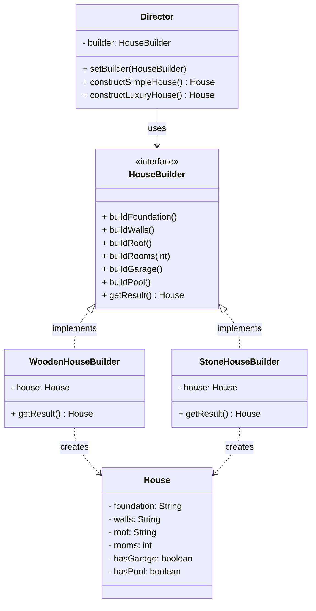

# Builder Design Pattern

The Builder pattern says: **instead of constructing a complex object all at once, build it step by step through a dedicated builder object.**

---

<details>
<summary><strong>The Problem Builder Solves</strong></summary>

### 🔴 The Core Pain: Telescoping Constructors

Imagine you're building a system that creates `House` objects. A house can have: foundation type, wall material, roof type, number of rooms, a garage, a swimming pool, a garden, a security system...

```java
// The constructor from hell
House h = new House("concrete", "brick", "tile", 4, true, false, true, false, 2);
// Quick — what does the third `true` mean? Nobody knows without reading the constructor.
```

You try to manage this with constructor overloads:

```java
public class House {
    House(String foundation, String walls, String roof) { ... }
    House(String foundation, String walls, String roof, int rooms) { ... }
    House(String foundation, String walls, String roof, int rooms, boolean garage) { ... }
    House(String foundation, String walls, String roof, int rooms, boolean garage, boolean pool) { ... }
    House(String foundation, String walls, String roof, int rooms, boolean garage, boolean pool, boolean garden) { ... }
    // Each new optional parameter doubles the overloads
}
```

That's Problem #1: **Unreadable constructors, exponential overloads, and positional parameter confusion.**

---

### 🔴 Problem #2: Half-Built Mutable Objects

You try setters instead to dodge the constructor mess:

```java
House h = new House();
h.setFoundation("concrete");
h.setWalls("brick");
// ... someone calls h.toString() here — no roof, no rooms!
h.setRoof("tile");
h.setRooms(4);
```

The object exists in an **incomplete, invalid state** between setter calls. You can't enforce "a house must have at least a foundation, walls, and roof before anyone uses it."

---

### 🔴 Problem #3: Same Build Process, Different Products

A wooden cabin and a stone mansion both follow the same construction sequence: foundation → walls → roof → interior. The **steps are identical**, but the **materials and result** differ at each step.

If you hardcode the construction logic, you can't reuse the same build sequence for different house types without copy-pasting the step order everywhere.

---

### ✅ The Insight Builder Uses

> **"Extract the construction code out of the product class and put it into separate objects called builders. Use a director to define the order of construction steps."**

This gives you:
- **Named steps** instead of positional parameters — `buildWalls("brick")` is self-documenting
- **No incomplete objects** — the product is only returned after all required steps are done
- **Reusable recipes** — the Director defines step order; swap the Builder to get a different product

</details>

---

<details>
<summary><strong>High-Level Structure (Class Diagram)</strong></summary>



**How to read this diagram:**

- The `Director` holds a reference to the `HouseBuilder` interface. It defines **what steps to call and in what order** (the recipe) but doesn't know which concrete builder is being used.
- The `HouseBuilder` interface declares all possible construction steps. This is the contract every builder must follow.
- Concrete builders (`WoodenHouseBuilder`, `StoneHouseBuilder`) implement the steps with specific materials and maintain a `House` instance they assemble piece by piece.
- The `House` is the Product — the complex object being built. It's created and populated by the builder, then returned to the client via `getResult()`.

</details>

---

<details>
<summary><strong>Participants — In Depth</strong></summary>

### 1. Product (House)

**Role:** The complex object being constructed. It has many parts — some mandatory, some optional — that together form a meaningful whole.

**Why it matters:** The Product itself is just a data holder. It doesn't know how it should be constructed. The construction logic is deliberately kept outside so that different builders can assemble different variants of the product.

```java
public class House {
    private String foundation;
    private String walls;
    private String roof;
    private int rooms;
    private boolean hasGarage;
    private boolean hasPool;

    public void setFoundation(String f)  { this.foundation = f; }
    public void setWalls(String w)       { this.walls = w; }
    public void setRoof(String r)        { this.roof = r; }
    public void setRooms(int r)          { this.rooms = r; }
    public void setHasGarage(boolean g)  { this.hasGarage = g; }
    public void setHasPool(boolean p)    { this.hasPool = p; }

    @Override
    public String toString() {
        return "House [foundation=" + foundation + ", walls=" + walls
            + ", roof=" + roof + ", rooms=" + rooms
            + ", garage=" + hasGarage + ", pool=" + hasPool + "]";
    }
}
```

> **Note:** The Product has setters (used only by the builder) but no giant constructor. The whole point is that the builder controls how the object gets filled in.

---

### 2. Builder (Interface)

**Role:** Declares the contract — all possible construction steps that any builder must support. The Director programs against this interface.

**Methods:**

| Method | What It Does |
|---|---|
| `buildFoundation()` | Construct the foundation layer |
| `buildWalls()` | Construct the walls |
| `buildRoof()` | Construct the roof |
| `buildRooms(int count)` | Add rooms to the house |
| `buildGarage()` | Add a garage (optional step) |
| `buildPool()` | Add a swimming pool (optional step) |
| `getResult(): House` | Return the assembled product and reset the builder for reuse |

**Why it matters:** The Builder interface decouples the Director from concrete builders. The Director calls `buildWalls()` — it doesn't know or care whether walls are wooden planks or stone blocks. Adding a new builder type (e.g., `GlassHouseBuilder`) requires zero changes to the Director.

```java
public interface HouseBuilder {
    void buildFoundation();
    void buildWalls();
    void buildRoof();
    void buildRooms(int count);
    void buildGarage();
    void buildPool();
    House getResult();
}
```

---

### 3. ConcreteBuilder (WoodenHouseBuilder, StoneHouseBuilder)

**Role:** Implements the construction steps using specific materials and logic. Maintains the Product instance and assembles it piece by piece.

**Attributes:**

| Attribute | Type | Purpose |
|---|---|---|
| `house` | `House` | The product being assembled — created fresh in the constructor, and again after each `getResult()` |

**Relationships:**
- **Implements** the `HouseBuilder` interface.
- **Creates and holds** the `House` product during construction.
- **Returns** the finished product via `getResult()`, then resets for the next build.

**Why it matters:** The concrete builder knows *how* to build with specific materials. Swapping `WoodenHouseBuilder` for `StoneHouseBuilder` produces a completely different house using the exact same Director recipe.

```java
public class WoodenHouseBuilder implements HouseBuilder {
    private House house;

    public WoodenHouseBuilder() { this.house = new House(); }

    @Override public void buildFoundation() { house.setFoundation("wooden pillars"); }
    @Override public void buildWalls()      { house.setWalls("wooden planks"); }
    @Override public void buildRoof()       { house.setRoof("wooden shingles"); }
    @Override public void buildRooms(int c) { house.setRooms(c); }
    @Override public void buildGarage()     { house.setHasGarage(true); }
    @Override public void buildPool()       { house.setHasPool(true); }

    @Override
    public House getResult() {
        House built = this.house;
        this.house = new House();  // reset for next build
        return built;
    }
}
```

---

### 4. Director

**Role:** Defines **which steps to call and in what order**. It encapsulates reusable construction recipes. It works with any builder through the `HouseBuilder` interface.

**Relationships:**
- **Has-a** `HouseBuilder` reference — injected via constructor or setter.
- **Does not know** the concrete builder type — interacts purely through the interface.
- **Does not hold** the product — it tells the builder what to do, then the client retrieves the result from the builder.

**Why it matters:** Without a Director, the client must manually call builder steps in the right order every time. The Director centralizes construction recipes:
- "Simple house" = foundation + walls + roof + 2 rooms
- "Luxury house" = foundation + walls + roof + 6 rooms + garage + pool
- Need a new recipe? Add one method in the Director. No changes to builders or products.

```java
public class ConstructionDirector {
    private HouseBuilder builder;

    public ConstructionDirector(HouseBuilder builder) {
        this.builder = builder;
    }

    public void setBuilder(HouseBuilder builder) {
        this.builder = builder;
    }

    public House constructSimpleHouse() {
        builder.buildFoundation();
        builder.buildWalls();
        builder.buildRoof();
        builder.buildRooms(2);
        return builder.getResult();
    }

    public House constructLuxuryHouse() {
        builder.buildFoundation();
        builder.buildWalls();
        builder.buildRoof();
        builder.buildRooms(6);
        builder.buildGarage();
        builder.buildPool();
        return builder.getResult();
    }
}
```

> **Note:** The Director is **optional**. The client can call builder steps directly for custom, one-off construction. But when you have repeatable recipes, the Director avoids duplicating the step sequence across clients.

</details>

---

<details>
<summary><strong>Cartoon Implementation Example: House Construction System</strong></summary>

Two types of houses (wooden and stone), two construction recipes (simple and luxury). The same Director recipe produces different results when paired with different builders.

### Step 1: The Product

```java
public class House {
    private String foundation;
    private String walls;
    private String roof;
    private int rooms;
    private boolean hasGarage;
    private boolean hasPool;

    public void setFoundation(String f)  { this.foundation = f; }
    public void setWalls(String w)       { this.walls = w; }
    public void setRoof(String r)        { this.roof = r; }
    public void setRooms(int r)          { this.rooms = r; }
    public void setHasGarage(boolean g)  { this.hasGarage = g; }
    public void setHasPool(boolean p)    { this.hasPool = p; }

    @Override
    public String toString() {
        return "House [foundation=" + foundation + ", walls=" + walls
            + ", roof=" + roof + ", rooms=" + rooms
            + ", garage=" + hasGarage + ", pool=" + hasPool + "]";
    }
}
```

### Step 2: The Builder Interface

```java
public interface HouseBuilder {
    void buildFoundation();
    void buildWalls();
    void buildRoof();
    void buildRooms(int count);
    void buildGarage();
    void buildPool();
    House getResult();
}
```

### Step 3: Concrete Builders

```java
public class WoodenHouseBuilder implements HouseBuilder {
    private House house;

    public WoodenHouseBuilder() { this.house = new House(); }

    @Override public void buildFoundation() {
        house.setFoundation("wooden pillars");
        System.out.println("  [Wood] Laying wooden pillar foundation");
    }
    @Override public void buildWalls() {
        house.setWalls("wooden planks");
        System.out.println("  [Wood] Raising wooden plank walls");
    }
    @Override public void buildRoof() {
        house.setRoof("wooden shingles");
        System.out.println("  [Wood] Adding wooden shingle roof");
    }
    @Override public void buildRooms(int count) {
        house.setRooms(count);
        System.out.println("  [Wood] Partitioning " + count + " rooms");
    }
    @Override public void buildGarage() {
        house.setHasGarage(true);
        System.out.println("  [Wood] Building wooden garage");
    }
    @Override public void buildPool() {
        house.setHasPool(true);
        System.out.println("  [Wood] Digging pool with wooden deck");
    }

    @Override
    public House getResult() {
        House built = this.house;
        this.house = new House();
        return built;
    }
}
```

```java
public class StoneHouseBuilder implements HouseBuilder {
    private House house;

    public StoneHouseBuilder() { this.house = new House(); }

    @Override public void buildFoundation() {
        house.setFoundation("reinforced concrete");
        System.out.println("  [Stone] Pouring reinforced concrete foundation");
    }
    @Override public void buildWalls() {
        house.setWalls("stone blocks");
        System.out.println("  [Stone] Stacking stone block walls");
    }
    @Override public void buildRoof() {
        house.setRoof("slate tiles");
        System.out.println("  [Stone] Laying slate tile roof");
    }
    @Override public void buildRooms(int count) {
        house.setRooms(count);
        System.out.println("  [Stone] Partitioning " + count + " rooms");
    }
    @Override public void buildGarage() {
        house.setHasGarage(true);
        System.out.println("  [Stone] Building stone garage");
    }
    @Override public void buildPool() {
        house.setHasPool(true);
        System.out.println("  [Stone] Digging pool with stone patio");
    }

    @Override
    public House getResult() {
        House built = this.house;
        this.house = new House();
        return built;
    }
}
```

### Step 4: The Director

```java
public class ConstructionDirector {
    private HouseBuilder builder;

    public ConstructionDirector(HouseBuilder builder) {
        this.builder = builder;
    }

    public void setBuilder(HouseBuilder builder) {
        this.builder = builder;
    }

    public House constructSimpleHouse() {
        builder.buildFoundation();
        builder.buildWalls();
        builder.buildRoof();
        builder.buildRooms(2);
        return builder.getResult();
    }

    public House constructLuxuryHouse() {
        builder.buildFoundation();
        builder.buildWalls();
        builder.buildRoof();
        builder.buildRooms(6);
        builder.buildGarage();
        builder.buildPool();
        return builder.getResult();
    }
}
```

### Step 5: Client Code — Putting It All Together

```java
public class Main {
    public static void main(String[] args) {

        // === Build a simple wooden house ===
        System.out.println("Building a SIMPLE WOODEN house:");
        WoodenHouseBuilder woodBuilder = new WoodenHouseBuilder();
        ConstructionDirector director = new ConstructionDirector(woodBuilder);
        House simpleWooden = director.constructSimpleHouse();
        System.out.println("Result: " + simpleWooden);

        // === Same Director recipe, different Builder → different house ===
        System.out.println("\nBuilding a LUXURY STONE house:");
        StoneHouseBuilder stoneBuilder = new StoneHouseBuilder();
        director.setBuilder(stoneBuilder);  // swap the builder
        House luxuryStone = director.constructLuxuryHouse();
        System.out.println("Result: " + luxuryStone);

        // === Build without a Director (custom one-off construction) ===
        System.out.println("\nBuilding a CUSTOM house (no Director):");
        WoodenHouseBuilder customBuilder = new WoodenHouseBuilder();
        customBuilder.buildFoundation();
        customBuilder.buildWalls();
        customBuilder.buildRoof();
        customBuilder.buildRooms(3);
        customBuilder.buildPool();  // simple house + pool — no predefined recipe for this
        House customHouse = customBuilder.getResult();
        System.out.println("Result: " + customHouse);
    }
}
```

<details>
<summary>Output</summary>

```
Building a SIMPLE WOODEN house:
  [Wood] Laying wooden pillar foundation
  [Wood] Raising wooden plank walls
  [Wood] Adding wooden shingle roof
  [Wood] Partitioning 2 rooms
Result: House [foundation=wooden pillars, walls=wooden planks, roof=wooden shingles, rooms=2, garage=false, pool=false]

Building a LUXURY STONE house:
  [Stone] Pouring reinforced concrete foundation
  [Stone] Stacking stone block walls
  [Stone] Laying slate tile roof
  [Stone] Partitioning 6 rooms
  [Stone] Building stone garage
  [Stone] Digging pool with stone patio
Result: House [foundation=reinforced concrete, walls=stone blocks, roof=slate tiles, rooms=6, garage=true, pool=true]

Building a CUSTOM house (no Director):
  [Wood] Laying wooden pillar foundation
  [Wood] Raising wooden plank walls
  [Wood] Adding wooden shingle roof
  [Wood] Partitioning 3 rooms
  [Wood] Digging pool with wooden deck
Result: House [foundation=wooden pillars, walls=wooden planks, roof=wooden shingles, rooms=3, garage=false, pool=true]
```

</details>

**Key observations from the output:**

1. **Same recipe, different results** — `constructLuxuryHouse()` is defined once in the Director, but produces a wooden house or a stone house depending on which builder is plugged in.
2. **Builder works without a Director** — the third example shows the client calling steps directly for a custom configuration that doesn't match any predefined recipe.
3. **Each step is self-documenting** — `buildWalls()` is clearer than the 3rd positional parameter in a 9-parameter constructor.
4. **Product is complete when returned** — `getResult()` hands over a fully assembled house. No half-built objects leak out.

</details>

---

<details>
<summary><strong>How the Participants Interact — Sequence of Events</strong></summary>

```
  Client              Director            Builder (WoodenHouseBuilder)        Product (House)
    |                    |                          |                            |
    |  constructSimple() |                          |                            |
    |───────────────────>|                          |                            |
    |                    |  buildFoundation()       |                            |
    |                    |─────────────────────────>|  setFoundation("wooden")   |
    |                    |                          |───────────────────────────>|
    |                    |  buildWalls()            |                            |
    |                    |─────────────────────────>|  setWalls("planks")        |
    |                    |                          |───────────────────────────>|
    |                    |  buildRoof()             |                            |
    |                    |─────────────────────────>|  setRoof("shingles")       |
    |                    |                          |───────────────────────────>|
    |                    |  buildRooms(2)           |                            |
    |                    |─────────────────────────>|  setRooms(2)               |
    |                    |                          |───────────────────────────>|
    |                    |  getResult()             |                            |
    |                    |─────────────────────────>|                            |
    |                    |    return house           |                            |
    |                    |<─────────────────────────|                            |
    |   return house     |                          |                            |
    |<───────────────────|                          |                            |
    |                                                                            |
    |── uses the fully                                                          |
    |   built house                                                             |
```

</details>

---

<details>
<summary><strong>Inner Static Builder — The Immutable Object Variant (Effective Java Style)</strong></summary>

### The Problem

You have an **immutable class** with many attributes and you want flexibility in object creation — skip optional fields, set fields in any order — without telescoping constructors.

> **Key difference from the GoF Builder above:** There is no Director, no Builder interface, no separate ConcreteBuilder classes. Instead, the Builder is a **static inner class** inside the product itself, and the product is **immutable** (no setters). This is the variant popularized by Joshua Bloch in *Effective Java*.

---

### The Teacher's Design Journey

**Step 1 — Identify the need:** The outer class is immutable (no setters). It has many attributes. Passing all of them via a constructor is rigid and error-prone.

**Step 2 — Create an inner class (the Builder):** This inner class has the **exact same attributes** as the outer class. The outer class constructor takes one parameter: an object of this inner Builder class.

**Step 3 — Make the Builder static:** Since the client needs to create a Builder object **without first having an outer class object**, the Builder must be a `static` inner class. (Static inner classes can be instantiated without an instance of the outer class.)

**Step 4 — Add setters with `return this`:** Each setter in the Builder class returns the Builder object itself (`return this`). This enables **method chaining**.

**Step 5 — Add a `build()` method:** This method inside the Builder class calls `new OuterClass(this)` and returns the **immutable** outer object.

---

### Key Rules

| Rule | Reason |
|---|---|
| Builder must be a **static inner class** | So it can be created without an outer class instance |
| Outer class constructor takes Builder object | Single parameter instead of many |
| Setters return `this` | Enables method chaining |
| `build()` method calls outer constructor | Converts mutable Builder to immutable object |
| Outer class has **no setters** | Ensures immutability after creation |

---

### Concrete Example: Immutable `Student` Class

<details>
<summary>Step 1: The Immutable Outer Class (Student)</summary>

```java
public class Student {
    // All fields are private and final — immutable
    private final String name;
    private final int age;
    private final String email;
    private final String phone;
    private final String address;
    private final String university;
    private final double gpa;

    // Private constructor — only the Builder can call this
    private Student(Builder builder) {
        this.name       = builder.name;
        this.age        = builder.age;
        this.email      = builder.email;
        this.phone      = builder.phone;
        this.address    = builder.address;
        this.university = builder.university;
        this.gpa        = builder.gpa;
    }

    // Only getters — no setters. Object is frozen after creation.
    public String getName()       { return name; }
    public int getAge()           { return age; }
    public String getEmail()      { return email; }
    public String getPhone()      { return phone; }
    public String getAddress()    { return address; }
    public String getUniversity() { return university; }
    public double getGpa()        { return gpa; }

    @Override
    public String toString() {
        return "Student [name=" + name + ", age=" + age + ", email=" + email
            + ", phone=" + phone + ", address=" + address
            + ", university=" + university + ", gpa=" + gpa + "]";
    }

    // ──────── The Builder lives here ────────
    // (see Step 2 below)
}
```

</details>

<details>
<summary>Step 2: The Static Inner Builder Class</summary>

```java
    // Inside Student class
    public static class Builder {
        // Same attributes as the outer class
        private String name;
        private int age;
        private String email;
        private String phone;
        private String address;
        private String university;
        private double gpa;

        // Constructor for required fields (if any)
        public Builder(String name) {
            this.name = name;  // name is mandatory
        }

        // Each setter returns 'this' for method chaining
        public Builder setAge(int age) {
            this.age = age;
            return this;
        }

        public Builder setEmail(String email) {
            this.email = email;
            return this;
        }

        public Builder setPhone(String phone) {
            this.phone = phone;
            return this;
        }

        public Builder setAddress(String address) {
            this.address = address;
            return this;
        }

        public Builder setUniversity(String university) {
            this.university = university;
            return this;
        }

        public Builder setGpa(double gpa) {
            this.gpa = gpa;
            return this;
        }

        // build() creates the immutable outer object
        public Student build() {
            return new Student(this);
        }
    }
```

</details>

<details>
<summary>Step 3: Client Code — How It's Used</summary>

```java
public class Main {
    public static void main(String[] args) {

        // === All fields set, any order ===
        Student alice = new Student.Builder("Alice")
            .setAge(21)
            .setEmail("alice@example.com")
            .setUniversity("MIT")
            .setGpa(3.9)
            .setPhone("555-1234")
            .setAddress("123 Main St")
            .build();

        System.out.println(alice);

        // === Skip optional fields — only set what you need ===
        Student bob = new Student.Builder("Bob")
            .setAge(22)
            .setEmail("bob@example.com")
            .build();

        System.out.println(bob);

        // === Minimal construction — only the required field ===
        Student charlie = new Student.Builder("Charlie")
            .build();

        System.out.println(charlie);
    }
}
```

**Output:**

```
Student [name=Alice, age=21, email=alice@example.com, phone=555-1234, address=123 Main St, university=MIT, gpa=3.9]
Student [name=Bob, age=22, email=bob@example.com, phone=null, address=null, university=null, gpa=0.0]
Student [name=Charlie, age=0, email=null, phone=null, address=null, university=null, gpa=0.0]
```

</details>

<details>
<summary>Complete Student.java (Full File)</summary>

```java
public class Student {
    private final String name;
    private final int age;
    private final String email;
    private final String phone;
    private final String address;
    private final String university;
    private final double gpa;

    private Student(Builder builder) {
        this.name       = builder.name;
        this.age        = builder.age;
        this.email      = builder.email;
        this.phone      = builder.phone;
        this.address    = builder.address;
        this.university = builder.university;
        this.gpa        = builder.gpa;
    }

    public String getName()       { return name; }
    public int getAge()           { return age; }
    public String getEmail()      { return email; }
    public String getPhone()      { return phone; }
    public String getAddress()    { return address; }
    public String getUniversity() { return university; }
    public double getGpa()        { return gpa; }

    @Override
    public String toString() {
        return "Student [name=" + name + ", age=" + age + ", email=" + email
            + ", phone=" + phone + ", address=" + address
            + ", university=" + university + ", gpa=" + gpa + "]";
    }

    public static class Builder {
        private String name;
        private int age;
        private String email;
        private String phone;
        private String address;
        private String university;
        private double gpa;

        public Builder(String name) {
            this.name = name;
        }

        public Builder setAge(int age)                 { this.age = age; return this; }
        public Builder setEmail(String email)           { this.email = email; return this; }
        public Builder setPhone(String phone)           { this.phone = phone; return this; }
        public Builder setAddress(String address)       { this.address = address; return this; }
        public Builder setUniversity(String university) { this.university = university; return this; }
        public Builder setGpa(double gpa)               { this.gpa = gpa; return this; }

        public Student build() {
            return new Student(this);
        }
    }
}
```

</details>

---

### Notes: Why Each Design Decision Matters

**1. Why `private` constructor on the outer class?**
The outer class constructor is `private` so that **nobody can create a `Student` directly** — they must go through the Builder. This ensures every `Student` object is fully assembled before it's exposed.

**2. Why `static` inner class?**
A non-static inner class requires an instance of the outer class to exist first. But we need the Builder *before* the outer object exists — we're using it to *create* the outer object. Making it `static` breaks this circular dependency.

**3. Why `return this` in setters?**
Returning `this` (the Builder itself) from every setter enables **method chaining** — calling `.setAge(21).setEmail("...")` in a single fluent expression. Without it, every setter call would be a separate statement.

**4. Why pass `this` (the Builder) to the outer constructor?**
Instead of passing 7 individual parameters, the outer constructor takes one Builder object and pulls values from it. This is the core trick — the Builder accumulates state mutably, then the constructor reads it all at once to create the immutable object.

**5. Why `final` fields and no setters on the outer class?**
This guarantees **immutability**. Once `build()` is called and the `Student` is created, its state can never change. This makes the object thread-safe, predictable, and safe to share across the system.

---

### How This Differs from the GoF Builder (Above)

| Aspect | GoF Builder (Director + Interface) | Inner Static Builder (Effective Java) |
|---|---|---|
| **Goal** | Same build process → different products | Flexible construction of one immutable class |
| **Builder location** | Separate class | Static inner class inside the product |
| **Interface** | Yes — `HouseBuilder` interface | No — single concrete Builder class |
| **Director** | Yes — defines step order | No — client chains setters directly |
| **Product mutability** | Typically mutable (has setters) | Immutable (`final` fields, no setters) |
| **Method chaining** | Not typical (void build methods) | Core feature (`return this`) |
| **Use case** | Complex construction with varying representations | Objects with many optional parameters |

</details>

---

<details>
<summary><strong>Builder vs. Other Creational Patterns</strong></summary>

| Question | Answer | Pattern |
|---|---|---|
| "I need to construct complex objects step by step" | Separate construction from representation | **Builder** |
| "I need a copy of an existing configured object" | Clone it | **Prototype** |
| "I need exactly one instance" | Restrict construction | **Singleton** |
| "I need to delegate creation to subclasses" | Let subclasses decide | **Factory Method** |
| "I need to create families of related objects" | Abstract the factory | **Abstract Factory** |

**Builder vs. Abstract Factory:** Both create complex objects. The difference — Builder constructs **step by step** and returns the product at the end. Abstract Factory returns each product **immediately** (each method call produces a complete object from a family).

</details>

---

<details>
<summary><strong>Common Mistakes to Avoid</strong></summary>

### 1. Forgetting to Reset the Builder After `getResult()`

```java
// WRONG — second build contaminates the first
public House getResult() {
    return this.house;  // next build modifies the same House object!
}

// CORRECT — reset for the next build
public House getResult() {
    House built = this.house;
    this.house = new House();  // fresh instance for next build
    return built;
}
```

### 2. Director Doing the Builder's Job

```java
// WRONG — Director creates the product directly, defeating the purpose
public House construct() {
    House h = new House();
    h.setFoundation("concrete");  // Director is hardcoding materials
    return h;
}

// CORRECT — Director orchestrates, Builder builds
public House construct() {
    builder.buildFoundation();  // Director tells builder WHAT to do
    builder.buildWalls();       // Builder decides HOW (which materials)
    return builder.getResult();
}
```

### 3. Exposing a Half-Built Product

```java
// WRONG — client can grab the product mid-construction
public House getCurrentHouse() {
    return this.house;  // might be incomplete!
}

// CORRECT — only expose via getResult() after all steps are done
```

### 4. Making the Inner Builder Non-Static (Effective Java variant)

```java
// WRONG — requires an outer class instance to create the Builder
public class Student {
    public class Builder { ... }  // non-static inner class
}
// Student.Builder b = new Student().new Builder("Alice"); // awkward and defeats the purpose

// CORRECT — static inner class, no outer instance needed
public class Student {
    public static class Builder { ... }
}
// Student.Builder b = new Student.Builder("Alice"); // clean
```

### 5. Forgetting to Return `this` in Builder Setters

```java
// WRONG — breaks method chaining
public void setAge(int age) {
    this.age = age;
}
// Forces: b.setAge(21); b.setEmail("..."); b.build(); // separate statements

// CORRECT — enables fluent API
public Builder setAge(int age) {
    this.age = age;
    return this;
}
// Allows: new Builder("Alice").setAge(21).setEmail("...").build();
```

</details>

---

<details>
<summary><strong>Viva Quick-Fire Answers</strong></summary>

**Q: What is the Builder pattern in one sentence?**
A: Separate the construction of a complex object from its representation, allowing the same construction process to create different representations.

**Q: When would you use it?**
A: When an object has many parameters (especially optional ones), when the construction process has multiple steps that may vary, or when the same build process should produce different representations.

**Q: What are the four participants?**
A: Product (what's being built), Builder (interface declaring build steps), ConcreteBuilder (implements the steps), Director (defines the order of steps).

**Q: Is the Director mandatory?**
A: No. The client can call builder steps directly. The Director is useful when you have reusable construction recipes that you don't want to duplicate across clients.

**Q: How is Builder different from Factory?**
A: Factory creates an object in **one step** (one method call returns a complete object). Builder creates an object in **multiple steps** (call several methods, then retrieve the finished product).

**Q: Can a Builder build different products?**
A: Typically, each ConcreteBuilder builds one type of product. But different ConcreteBuilders implementing the same interface can produce structurally different products from the same set of steps.

**Q: What does `getResult()` do?**
A: Returns the fully assembled product and resets the builder's internal state so it's ready for the next build.

**Q: Why must the Inner Builder be static?**
A: Because the Builder needs to be instantiated *before* the outer class object exists. A non-static inner class requires an instance of the enclosing class, creating a chicken-and-egg problem.

**Q: What makes the Effective Java Builder different from the GoF Builder?**
A: GoF uses Director + Builder interface for varying representations. Effective Java uses a static inner Builder class with method chaining to construct a single immutable class with many optional parameters. No Director, no interface.

**Q: How does the Inner Builder ensure immutability?**
A: The outer class has `final` fields, a `private` constructor (only the Builder calls it), and no setters. Once `build()` is called, the object is frozen forever.

</details>
