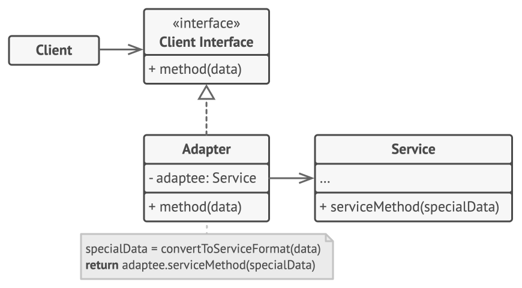

# Adapter Pattern

## Intent

Adapter is a structural design pattern that allows objects with incompatible interfaces to collaborate.

**Interface Definition**: A set of functions an object exposes to its client to interact with the object.

### Example: Payment Service

A `PaymentService` client needs to interact with multiple payment gateways, each with incompatible interfaces:

```python
import razorpay
razorpay.makePayment()

import stripe
stripe.pay()

import paynow
paynow.payment()
```

**Problem**: These are third-party libraries that we cannot change. Modifying them could break functionality, and using them directly means our codebase uses three different method names for the same operation. Which will lead to confusion when are codebase becomes very large as we are not using common terminology for the same operation. 

**Solution**: Use the Adapter pattern to create a translation layer between the client and incompatible third-party classes.

## Structure & Participants



*Image credits: [refactoring.guru](https://refactoring.guru/design-patterns/adapter)*

---
## Key characteristics:
- The adapter does **no actual work** -- it only delegates.
- It translates method names/signatures from one interface to another.
- The original classes remain completely untouched.
---

## Applicability

### Use Case 1: Incompatible Third-Party Code

**Problem**: You want to use an existing class, but its interface isn't compatible with your code.

**Example**: Two e-commerce companies merged. Both systems have similar methods with different names.

**Solution**: Create an Adapter class that serves as a translator between your code and the third-party/legacy class with an incompatible interface.


### Use Case 2: Adding Functionality Without Modifying Original Classes

**Problem**: You want to reuse existing subclasses that lack common functionality, but you cannot add it to the superclass without violating the Open/Closed Principle.

**Example**: 
- You have a `Background` class already implemented
- You need to implement the `Observer` interface, which requires a `notify()` method
- Adding `notify()` directly to `Background` would require re-testing all its methods (violation of Open/Closed Principle)

**Solution**: Create a `BackgroundAdapter` that:
- Holds a reference to the original `Background` class
- Implements the `Observer` interface
- Delegates the core task to the original class without modifying it


## Comparison with Strategy Pattern

| Aspect | Adapter | Strategy |
|--------|---------|----------|
| **Purpose** | Adds a translation layer between objects with incompatible interfaces | Provides a set of different variants of the same algorithm |
| **Implementation** | Classes implement the same interface but **delegate** work to the original class. The adapter does no actual work -- it only delegates. | Classes implement the same interface and **contain their own complete implementation** |
| **Use Case** | Making incompatible objects work together | Selecting different algorithms at runtime |

#### Teacher's Rule About Legacy Code

> "If this is legacy code -- people who wrote it have left, there is no one to maintain it -- ideally we should not be touching it. Just test whether it works. If it works, let it be. Do not make any changes. In case of when change is need prefer going by adapter design pattern if dealing with legacy code ."

NOTE: What if directly change name of methods of legacy code to make them compatible with current code? Those methods are used by other microservices in legacy code base ecosystem. Renaming would break them.
