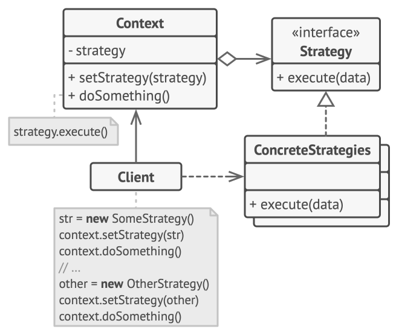

# Strategy Pattern

## Intent

Strategy is a behavioral design pattern that lets you define a family of algorithms, put each of them into a separate class, and make their objects interchangeable.

## Pattern Structure

*Image credits: [refactoring.guru](https://refactoring.guru/design-patterns/strategy)*

## Applicability

Use the Strategy pattern when you want to:
- Use different variants of an algorithm within an object
- Switch from one algorithm to another during runtime
- Avoid conditional statements for behavior selection
- Encapsulate different algorithms in separate classes

## Concrete OG Example

- [Link](https://refactoring.guru/design-patterns/strategy/java/example) - refactoring.guru